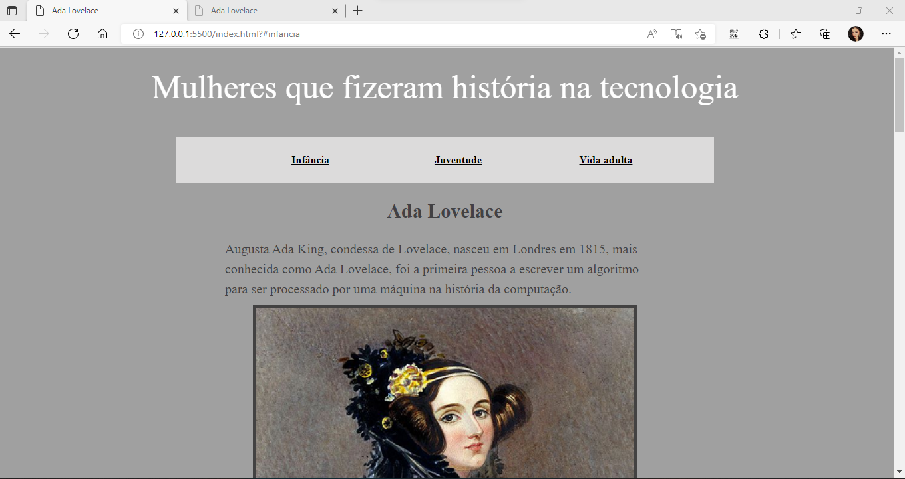
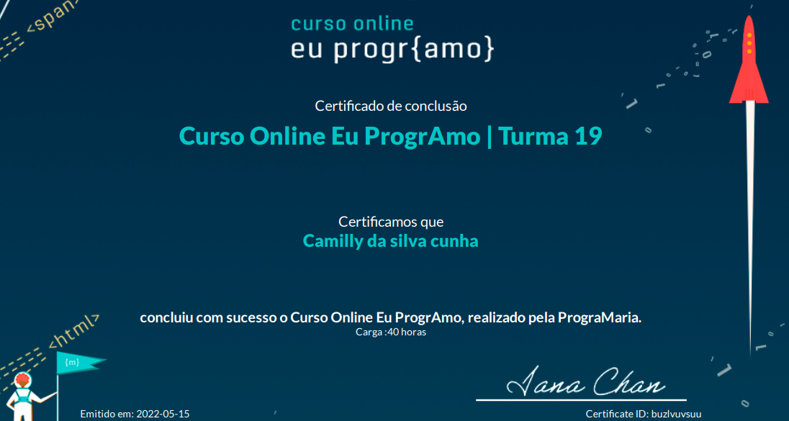

 Este site foi construído para um projeto de curso "programaria" com enfoque em apresentar mulheres que estiveram dentro da tecnologia e muitas das vezes nem sabemos sobre a história. O curso além de tecnológico e didático foi histórico e imersivo. 

